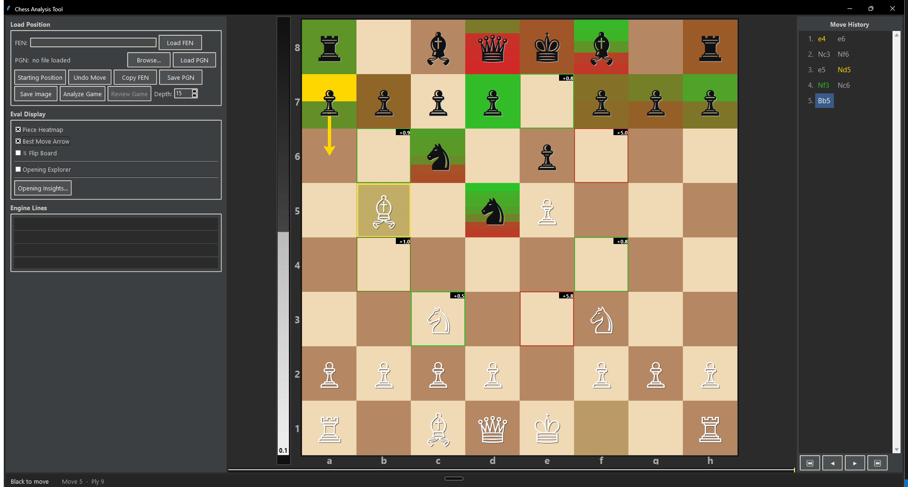

# Chess Analyzer

A desktop chess analysis tool built with Python and tkinter. Hover over pieces to see Stockfish evaluations, explore move heatmaps, and look up what moves real players have made from any position.




*Hovering the d5 knight: Stockfish scores every legal move (+5.8 on e3, +5.0 on f6), the heatmap bands each piece best-to-worst, and the gold arrow marks the engine's top choice.*

## Features

- **Hover evaluation** — hover over any piece to see Stockfish's score for every legal move
- **Piece heatmap** — color-coded bands on each piece showing best (gold) to worst (red) moves
- **Position eval bar** — vertical bar showing who is winning
- **Move history** — scrollable, color-coded move list; click any move to jump to that position
- **Opening Explorer** — see what moves real players have made from the current position (requires free Lichess API token)
- **Opening Insights** — searches the Lichess opening tree for moves that beat the position's average win rate; filter by color, rating and time control, sort the results, and click any row to replay the line on the board
- **Incremental analysis** — board colors update move-by-move as Stockfish finishes each line
- **Click or drag** to move pieces
- **PGN import/export** and FEN load/copy
- **Board flip**, best-move arrow, arrow key navigation
- Stockfish 17 **downloads automatically** on first run

## Requirements

- Python 3.10+
- Windows (tested on Windows 11)

## Installation

```bash
git clone https://github.com/AntonyParks/chess-analyzer.git
cd chess-analyzer
pip install -r requirements.txt
python chess_analyzer/main.py
```

Stockfish will download automatically the first time you run the app (~60 MB, one-time).

## Lichess data features (optional)

Two features read move statistics from millions of Lichess games, and both use the same token:

1. Create a free API token at [lichess.org/account/oauth/token](https://lichess.org/account/oauth/token) (no special permissions needed)
2. Paste your token into the field in the app and click **Save**

**Opening Explorer** — check the box to see how often each move has been played from the
current position, and how it scored.

**Opening Insights** — click **Opening Insights...** to walk the opening tree from the
current position and surface moves whose win rate is well above the average for that
position. Tune the delta threshold, minimum game count, and rating/time-control filters,
then select a result to jump to it — the move is drawn on the board as a purple arrow.

## Dependencies

- [`chess`](https://python-chess.readthedocs.io/) — board logic, move generation, PGN parsing
- [`pillow`](https://pillow.readthedocs.io/) — *optional*; used for smooth piece-image scaling. The app falls back to unscaled images if it is not installed.
- Stockfish 17 — downloaded automatically to `chess_analyzer/engines/`
